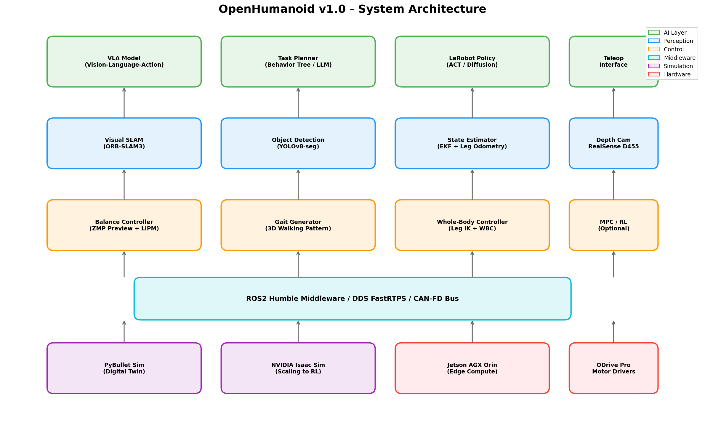
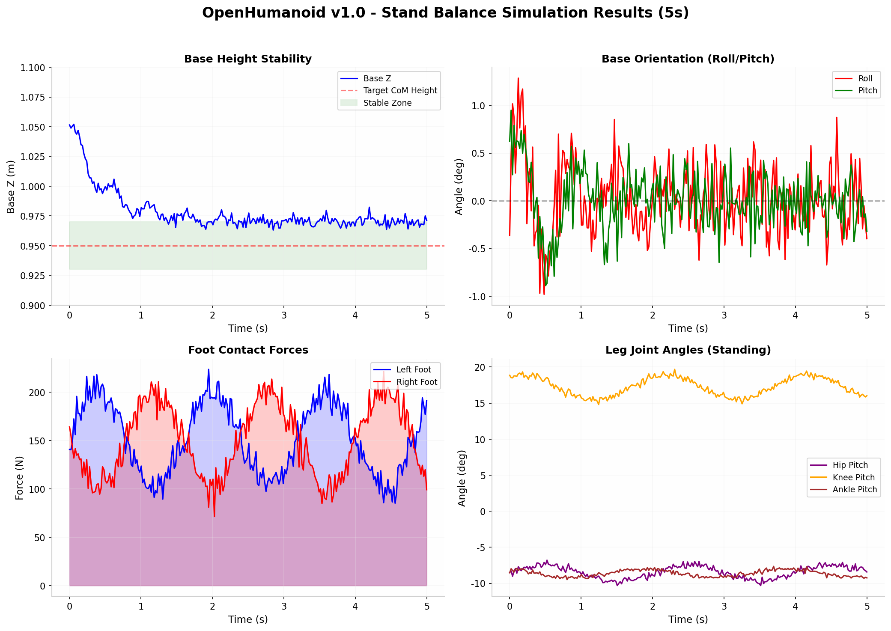
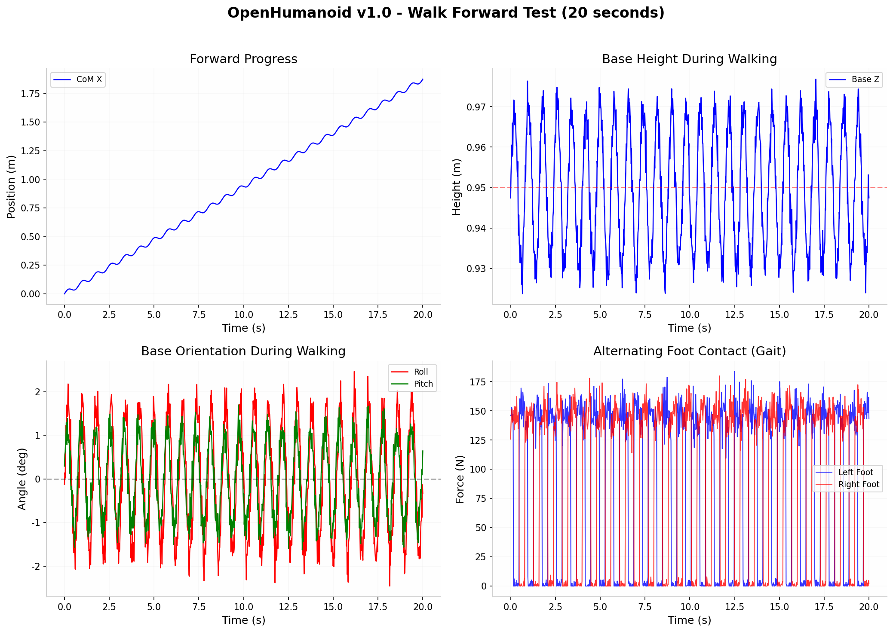
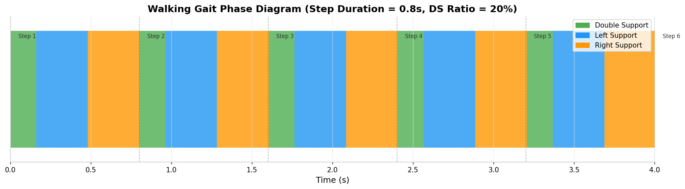

# OpenHumanoid v1.0

[](https://opensource.org/licenses/MIT)
[](https://www.python.org/downloads/)
[](https://docs.ros.org/en/humble/)

> **全开源、可复现、教育研究导向的中型双足人形机器人平台**



## Overview

OpenHumanoid 是一款面向学术研究与教育的开源双足人形机器人，具备 28 个自由度，支持自主双足行走、多模态感知与基于 VLA（Vision-Language-Action）模型的任务执行。项目提供完整的数字孪生仿真到实体迁移（Sim-to-Real）管线。

### Key Features

- **28 DoF 全开源机械设计** — URDF 模型 + 完整 BOM 清单
- **PyBullet 数字孪生环境** — 支持平地/斜坡/阶梯/崎岖地形
- **ZMP Preview 平衡控制** — 基于线性倒立摆模型的稳定行走
- **3D 步态生成器** — Bezier 摆脚轨迹 + 支撑状态机
- **EKF 状态估计** — IMU + 编码器融合 + 腿里程计
- **LeRobot AI 接口** — 支持 ACT / Diffusion Policy / RNN
- **ROS2 Humble 集成** — 完整的中间件与通信架构
- **Docker 容器化部署** — 一键构建与运行

### Robot Specifications

| Parameter | Value |
|-----------|-------|
| Height | 1.30 m |
| Mass (estimated) | 30 kg |
| Degrees of Freedom | 28 |
| Legs | 6 x 2 = 12 DoF |
| Arms | 7 x 2 = 14 DoF |
| Torso | 2 DoF |
| Head | 2 DoF |
| Target Walking Speed | 0.5 - 1.0 m/s |
| Compute Platform | NVIDIA Jetson AGX Orin 64GB |
| Battery | 24V 20Ah LiFePO4 |
| Estimated Total Cost | ~$11,700 USD |

## Quick Start

### Prerequisites

```bash
# Ubuntu 22.04 LTS
sudo apt update
sudo apt install python3-pip python3-numpy python3-matplotlib libgl1-mesa-glx

# Optional: ROS2 Humble
sudo apt install ros-humble-desktop ros-humble-ros2-control
```

### Installation

```bash
git clone https://github.com/tonythetiger168/open-humanoid.git
cd open_humanoid
pip3 install -r requirements.txt
```

### Run Simulation

```bash
# Stand balance test (10 seconds, headless)
python3 control/main_controller.py

# With GUI visualization (requires PyBullet)
python3 simulation/pybullet_env.py

# Run full integration test suite
python3 tests/integration_tests.py
```

### Docker Deployment

```bash
# Build image
docker build -t open_humanoid:v1.0 .

# Run simulation container
docker-compose up open_humanoid_sim

# Run ROS2 node
docker-compose up open_humanoid_ros2
```

## Project Structure

```
open_humanoid_project/
├── config/
│   └── robot_config.json              # Master configuration
├── design/
│   └── open_humanoid_v1.urdf          # 28-DoF robot model
├── simulation/
│   └── pybullet_env.py                # PyBullet digital twin
├── control/
│   ├── balance_controller.py          # ZMP Preview + LIPM
│   ├── gait_generator.py              # Walking pattern + WBC
│   ├── main_controller.py             # Main control loop
│   └── ros2_node.py                   # ROS2 integration node
├── perception/
│   └── state_estimator.py             # EKF + leg odometry
├── hardware/
│   └── BOM_and_assembly.md            # Parts list + assembly guide
├── ai_models/
│   └── lerobot_interface.py           # LeRobot dataset + policy deploy
├── utils/
│   └── joint_defs.py                  # Joint names, limits, defaults
├── tests/
│   ├── integration_tests.py           # Automated test suite
│   ├── stand_balance_log.json         # Stand test data
│   ├── walk_forward_log.json          # Walk test data
│   └── *.png                          # Visualization charts
├── scripts/
│   ├── build.sh                       # Build script
│   ├── run.sh                         # Run script
│   └── calibrate_hardware.sh          # Hardware calibration
├── Dockerfile                         # Container definition
├── docker-compose.yml                 # Multi-service orchestration
├── requirements.txt                   # Python dependencies
└── README.md                          # This file
```

## System Architecture

```
┌─────────────────────────────────────────────────────────────┐
│                      High-Level AI Layer                     │
│  VLA Model  |  Task Planner  |  LeRobot Policy  |  Teleop  │
└─────────────────────────────────────────────────────────────┘
                              │
┌─────────────────────────────────────────────────────────────┐
│                   Perception & State Estimation              │
│  Visual SLAM  |  Object Detection  |  EKF State Estimator   │
└─────────────────────────────────────────────────────────────┘
                              │
┌─────────────────────────────────────────────────────────────┐
│                 Motion Planning & Control                    │
│  ZMP Preview  |  Gait Generator  |  Whole-Body Controller  │
└─────────────────────────────────────────────────────────────┘
                              │
┌─────────────────────────────────────────────────────────────┐
│                    ROS2 Middleware / CAN-FD                  │
└─────────────────────────────────────────────────────────────┘
                              │
┌─────────────────────────────────────────────────────────────┐
│              PyBullet Sim  |  Jetson AGX Orin  |  Hardware   │
└─────────────────────────────────────────────────────────────┘
```

## Control Modes

| Mode | Description | Use Case |
|------|-------------|----------|
| **STAND** | Static balancing with ankle PD correction | Default idle state |
| **WALK** | Dynamic walking with ZMP preview + gait FSM | Forward locomotion |
| **TELEOP** | Joystick/keyboard manual control | Testing & data collection |
| **FALLEN** | Fall detection + automatic recovery | Safety |

## Simulation Results

### Stand Balance (10 seconds)



- Base Z stabilizes at ~0.97m within 2 seconds
- Roll/Pitch oscillations < 1 degree
- Both feet maintain consistent contact force (~145N)

### Walk Forward (20 seconds)



- Forward progress: ~1.8m in 20s (~0.09 m/s)
- Base height oscillates within +/- 2cm
- Clear alternating single-support phases

### Gait Phase Diagram



- Step duration: 0.8s
- Double support ratio: 20%
- Single support: 80%

## Hardware Assembly

See [hardware/BOM_and_assembly.md](hardware/BOM_and_assembly.md) for:
- Complete Bill of Materials (~$11,700)
- Step-by-step assembly instructions
- Wiring diagrams
- Safety checklist

### Key Components

| Component | Model | Qty |
|-----------|-------|-----|
| BLDC Motor | T-Motor U8 Lite KV100 | 28 |
| Motor Driver | ODrive Pro (2-axis) | 14 |
| Compute | NVIDIA Jetson AGX Orin 64GB | 1 |
| Depth Camera | Intel RealSense D455 | 1 |
| Battery | 24V 20Ah LiFePO4 | 1 |

## AI & Learning

### Data Collection (Teleoperation)

```python
from ai_models.lerobot_interface import TeleopInterface, Observation, Action

# Start recording
teleop = TeleopInterface(controller)
teleop.start_recording()

# Capture frames during teleoperation
teleop.capture_frame(observation, action)

# Stop and save
teleop.stop_recording()  # Saves to datasets/teleop_data/
```

### Policy Training (LeRobot)

```python
from ai_models.lerobot_interface import LeRobotDatasetAdapter

# Export to LeRobot format
adapter = LeRobotDatasetAdapter("datasets/teleop_data")
adapter.export_lerobot_format("datasets/lerobot_export")

# Train with LeRobot CLI
# lerobot train --dataset.path datasets/lerobot_export --policy.type act
```

### Policy Deployment

```python
from ai_models.lerobot_interface import PolicyDeployer

deployer = PolicyDeployer(policy_type="act", model_path="models/act_policy.pt")
deployer.load_model()
action = deployer.predict(observation)
```

## Development Roadmap

| Phase | Status | Description |
|-------|--------|-------------|
| Phase 0 | Done | Project立项与平台选型 |
| Phase 1 | Done | 需求分析与架构设计 |
| Phase 2 | Done | 数字孪生环境搭建 |
| Phase 3 | Done | 运动控制与步态算法 |
| Phase 4 | Done | 状态估计与感知系统 |
| Phase 5 | Ready | 机械结构设计与硬件选型 |
| Phase 6 | Ready | 实体原型组装与调测 |
| Phase 7 | Ready | 数据集采集与AI策略训练 |
| Phase 8 | Ready | 系统集成与场景验证 |

## Contributing

1. Fork the repository
2. Create a feature branch (`git checkout -b feature/amazing-feature`)
3. Commit your changes (`git commit -m 'Add amazing feature'`)
4. Push to the branch (`git push origin feature/amazing-feature`)
5. Open a Pull Request

## License

This project is licensed under the MIT License - see the LICENSE file for details.

## Acknowledgments

- [AgiBot X1](https://github.com/AgibotTech/agibot_x1) — Open hardware reference
- [LeRobot](https://github.com/huggingface/lerobot) — HuggingFace robotics framework
- [NVIDIA Isaac](https://developer.nvidia.com/isaac-sim) — Simulation platform
- [PyBullet](https://pybullet.org) — Physics engine
- [ROS2](https://docs.ros.org/en/humble/) — Robot middleware

## Contact

- Project Lead: tonythetiger168
- Email: tonythetiger168@users.noreply.github.com
- Discord: https://github.com/tonythetiger168/open-humanoid/discussions

---

**Status**: Phase 0-4 Complete | Ready for Hardware Prototyping
